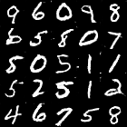
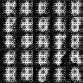
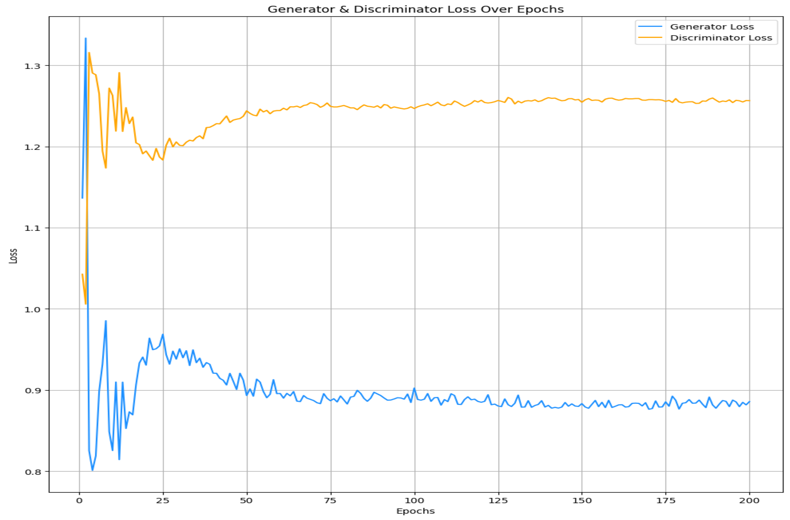

# DCGAN for MNIST Data Generation


## Overview
This repository implements a Deep Convolutional Generative Adversarial Network (DCGAN) to generate ssynthetic handwritten digit images similar to those in the MNIST dataset.


## Project Description
The goal is to train a DCGAN that learns the distribution of the MNIST dataset and produces realistic handwritten digits. The implementation consists of two main neural networks:
- **Generator:** Converts a random noise vector into a 28×28 grayscale image.
- **Discriminator:** Distinguishes between real images from the MNIST dataset and images generated by the Generator.

The adversarial training process allows both models to improve over time—ultimately resulting in a generator capable of producing plausible digits.


## Implementation Details
- **Language & Framework:** Python 3.12 with TensorFlow 2.x (using Keras API)
- **Training Parameters:**
  - **Epochs:** 200
  - **Loss Function:** Binary Cross-Entropy is used for both generator and discriminator losses
  - **Optimizers:** Adam optimizer with customized learning rates and decay schedules
- **Data:** Utilized MNIST dataset. MNIST is a dataset of 70,000 28×28 grayscale images of handwritten digits, split into 60,000 training and 10,000 test samples. It is widely used as a benchmark for image classification and deep learning experiments due to its simplicity and standardized format. [MNIST DATA](https://www.tensorflow.org/datasets/keras_example)
 
- **Generator**
``bash
    def build_generator():
        model = tf.keras.Sequential([
            layers.Dense(7*7*256, use_bias=False, input_shape=(100,)),  # Input: Noise vector
            layers.Reshape((7, 7, 256)),  # Reshape to small feature map
            layers.BatchNormalization(),
            layers.LeakyReLU(alpha=0.2),

            layers.Conv2DTranspose(128, (4,4), strides=(2,2), padding='same', use_bias=False),
            layers.BatchNormalization(),
            layers.LeakyReLU(alpha=0.2),

            layers.Conv2DTranspose(64, (4,4), strides=(2,2), padding='same', use_bias=False),
            layers.BatchNormalization(),
            layers.LeakyReLU(alpha=0.2),
            
            layers.Conv2DTranspose(1, (4,4), strides=1, padding="same", activation="tanh")
        ])
        
        return model

    generator = build_generator()
    generator.summary()
``

## Results

<table style="width:100%; margin:auto;">
  <tr>
    <th style="text-align:center;">Final Epoch Grid</th>
    <th style="text-align:center;">Training Gif</th>
  </tr>
  <tr>
    <td align="center">
      
    </td>
    <td align="center">
      
    </td>
  </tr>
</table>


## Loss Function Over 200 Epochs
The loss plot below depicts the training progress, showing the generator and discriminator losses throughout 200 epochs.
  



## Development Environment
- **Operating Systems:**
  - Local development on macOS
  - HPC cluster (Linux) for large-scale training
- **Python Version:** 3.12
- **TensorFlow Version:** 2.x (tested with TensorFlow 2.9+)
- **CUDA Version:** 12.4 (for GPU acceleration)
- **Additional Tools:**
  - **Jupyter Notebook** for interactive experiment development.
  - **SLURM** for job scheduling on the HPC cluster.
  - **Homebrew** for package management on macOS.


## How to Run
1. **Clone the Repository**
   ```bash
   git clone <repository-url>
   cd <repository-folder>